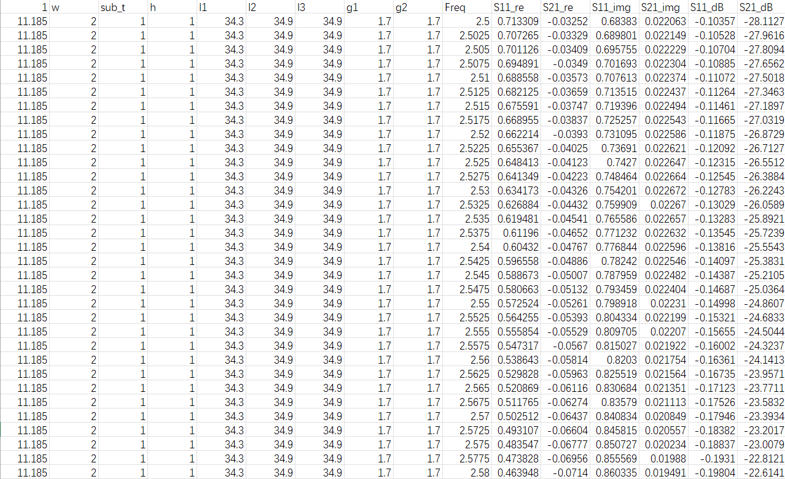

# 5th-orderr-Microstrip-BPF-Filter-Dataset
Datasets of 5th-Order Microstrip BPF with HFSS
# Reproduced Dataset for Surrogate-Based EM Optimization (5th-Order Microstrip BPF)

This repository contains a custom-reproduced, high-quality electromagnetic (EM) simulation dataset based on the methodology proposed in the paper:
> **"Surrogate-Based EM Optimization Using Neural Networks for Microwave Filter Design"** (IEICE Transactions on Electronics, 2022)

## 📌 Dataset Overview

While the original paper utilized a dataset of 6,300 training samples and 2,000 validation samples, this reproduced dataset expands and adjusts the data volume to better suit deep learning pipelines:
* **Training Set (`train.csv`):** 6,850 samples
* **Test Set (`test.csv`):** 1,777 samples

The dataset bridges the gap between the physical geometry of a symmetric fifth-order microstrip bandpass filter (BPF) and its frequency-domain electrical responses ($S$-parameters).

## 📊 Data Structure & Preview

The data is saved in standard `.csv` format. Each row represents a specific frequency sampling point for a given physical structural configuration.

### Data Columns Breakdown
* **Inputs (Geometric & Material Parameters):**
  * `l`: Resonator length indicator / T-feed line length `lq`
  * `w`: Microstrip resonator width (fixed at 2.0 mm)
  * `sub_t`: Substrate thickness (1.0 mm)
  * `h`: Dielectric constant / height characteristics
  * `l1`, `l2`, `l3`: Physical lengths of the coupled resonators
  * `g1`, `g2`: Coupling gaps between adjacent resonators
* **Outputs (EM Responses across Frequencies):**
  * `Freq`: Sampling frequency point (in GHz)
  * `S11_re` / `S11_img`: Real and imaginary parts of the reflection coefficient ($S_{11}$)
  * `S21_re` / `S21_img`: Real and imaginary parts of the transmission coefficient ($S_{21}$)
  * `S11_dB` / `S21_dB`: $S$-parameters expressed in decibels (dB)

### Dataset Screenshot
Below is a preview of the structured CSV data:



## 🚀 Quick Start (Python Example)

You can easily load this dataset using `pandas` for your surrogate models (Forward or Inverse neural networks):

```python
import pandas as pd

# Load the dataset
train_df = pd.read_csv('train.csv')
test_df = pd.read_csv('test.csv')

# Example: Extract geometric features and S-parameters in dB
features = train_df[['l1', 'l2', 'l3', 'g1', 'g2']]
responses = train_df[['Freq', 'S11_dB', 'S21_dB']]

print(f"Training features shape: {features.shape}")
